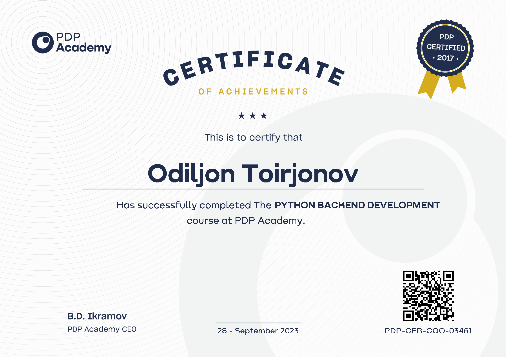

<h1 align="left">Hi my name is Odiljon</h1>
 <a href="https://odiljon11.netlify.app/" >Resume</a>
<h3 align="left">I am a novice web developer, I have basic knowledge in Python, Django, PostgreSQL, git, GitHub, I can work both alone and in a team. Looking for a job/internship to gain experience in your field and start your career path in IT</h3>
 

<h3 align="left">Connect with me:</h3>
 

 

<h3>CERTIFICATE:</h3>

 

 

 

